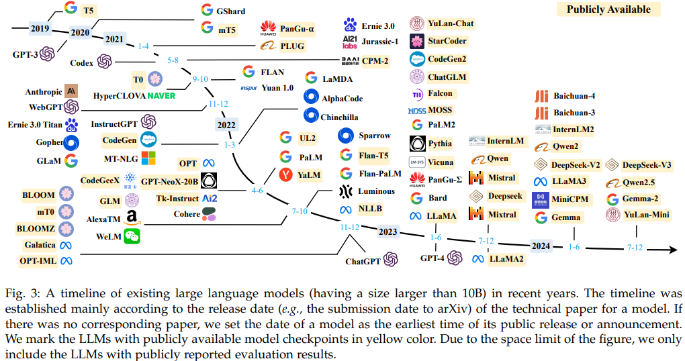

<!-- 記事URL:https://github.com/takata150802/tech_glossary/blob/main/output/ai/llm.md# -->

## 大規模言語モデル| Large Language Model | LLM

- 大規模な計算資源を使い、一般的に<a href="https://github.com/takata150802/tech_glossary/blob/main/output/ml-dl-nlp.md#VHJhbnNmb3JtZXI=">Transformer</a>ベースの大規模な言語モデルを、Web上から収集した大規模なテキストデータで学習させたモデル。
  - 2010年代、**主に画像認識や<a href="https://github.com/takata150802/tech_glossary/blob/main/output/ai/deep-learning.md#54mp5L2T5qSc5Ye6IHwgT2JqZWN0IERldGVjdGlvbg==">物体検出</a>を行う画像系の<a href="https://github.com/takata150802/tech_glossary/blob/main/output/dl-overview.md#5rex5bGk5a2m57+SIHwgRGVlcCBMZWFybmluZw==">深層学習</a>モデルの研究開発が注目を集め、本来ゲーミング用途に使われるGPUが<a href="https://github.com/takata150802/tech_glossary/blob/main/output/dl-overview.md#5rex5bGk5a2m57+SIHwgRGVlcCBMZWFybmluZw==">深層学習</a>モデルの研究開発に用いられるようになった(GPGPUの一環)**。その後、Google社主導の<a href="https://github.com/takata150802/tech_glossary/blob/main/output/dl-train_eval.md#VGVuc29yRmxvdw==">TensorFlow</a>やMeta社(旧Facebook社)主導の<a href="https://github.com/takata150802/tech_glossary/blob/main/output/dl-train_eval.md#UHlUb3JjaA==">PyTorch</a>といった<a href="https://github.com/takata150802/tech_glossary/blob/main/output/dl-overview.md#5rex5bGk5a2m57+SIHwgRGVlcCBMZWFybmluZw==">深層学習</a>フレームワークがOSSでライセンスの範囲内で自由に利用できることも手伝って、**大規模なGPU計算資源を使った<a href="https://github.com/takata150802/tech_glossary/blob/main/output/dl-overview.md#5rex5bGk5a2m57+SIHwgRGVlcCBMZWFybmluZw==">深層学習</a>モデルの学習が様々な研究機関・大学・企業で行われるようになった。**
  - 2017年、**Google社の論文「<a href="https://github.com/takata150802/tech_glossary/blob/main/output/ai/llm.md#44Ki44OG44Oz44K344On44OzIHwgQXR0ZW50aW9u">Attention</a> Is All You Need」にて提唱された自然言語系の<a href="https://github.com/takata150802/tech_glossary/blob/main/output/dl-overview.md#5rex5bGk5a2m57+SIHwgRGVlcCBMZWFybmluZw==">深層学習</a>モデル<a href="https://github.com/takata150802/tech_glossary/blob/main/output/ml-dl-nlp.md#VHJhbnNmb3JtZXI=">Transformer</a>は、<a href="https://github.com/takata150802/tech_glossary/blob/main/output/ai/deep-learning.md#6Ieq54S26KiA6Kqe5Yem55CGIHwgTkxQ">自然言語処理</a>、特に機械翻訳の分野で優れた性能を示し、<a href="https://github.com/takata150802/tech_glossary/blob/main/output/ai/deep-learning.md#6Ieq54S26KiA6Kqe5Yem55CGIHwgTkxQ">自然言語処理</a>のおける<a href="https://github.com/takata150802/tech_glossary/blob/main/output/dl-overview.md#5rex5bGk5a2m57+SIHwgRGVlcCBMZWFybmluZw==">深層学習</a>のブレイクスルー**となった。この<a href="https://github.com/takata150802/tech_glossary/blob/main/output/dl-overview.md#5rex5bGk5a2m57+SIHwgRGVlcCBMZWFybmluZw==">深層学習</a>モデル<a href="https://github.com/takata150802/tech_glossary/blob/main/output/ml-dl-nlp.md#VHJhbnNmb3JtZXI=">Transformer</a>の最も重要なアイディアである<a href="https://github.com/takata150802/tech_glossary/blob/main/output/ai/llm.md#44Ki44OG44Oz44K344On44OzIHwgQXR0ZW50aW9u">アテンション</a>機構は、ほぼ全ての著名な<a href="https://github.com/takata150802/tech_glossary/blob/main/output/ai/llm.md#5aSn6KaP5qih6KiA6Kqe44Oi44OH44OrfCBMYXJnZSBMYW5ndWFnZSBNb2RlbCB8IExMTQ==">LLM</a>が継承しているアイディアであるので、本論文は<a href="https://github.com/takata150802/tech_glossary/blob/main/output/ai/llm.md#5aSn6KaP5qih6KiA6Kqe44Oi44OH44OrfCBMYXJnZSBMYW5ndWFnZSBNb2RlbCB8IExMTQ==">LLM</a>分野における基礎的な論文とみなされている。
  - 2018年、Open<a href="https://github.com/takata150802/tech_glossary/blob/main/output/ai/ai-general.md#5Lq65bel55+l6IO9IHwgQXJ0aWZpY2lhbCBJbnRlbGxpZ2VuY2UgfCBBSQ==">AI</a>社の論文「Improving Language Understanding by Generative Pre-Training」で初めて、GPT(=いわゆる<a href="https://github.com/takata150802/tech_glossary/blob/main/output/ai/llm.md#5aSn6KaP5qih6KiA6Kqe44Oi44OH44OrfCBMYXJnZSBMYW5ndWFnZSBNb2RlbCB8IExMTQ==">LLM</a>の<a href="https://github.com/takata150802/tech_glossary/blob/main/output/ai/llm-training.md#5LqL5YmN5a2m57+SIHwgUHJlLXRyYWluaW5n">事前学習</a>)が提唱された。従来、<a href="https://github.com/takata150802/tech_glossary/blob/main/output/ai/deep-learning.md#6Ieq54S26KiA6Kqe5Yem55CGIHwgTkxQ">自然言語処理</a>系の<a href="https://github.com/takata150802/tech_glossary/blob/main/output/dl-overview.md#5rex5bGk5a2m57+SIHwgRGVlcCBMZWFybmluZw==">深層学習</a>モデルは人手でラベル付けしたデータセットで<a href="https://github.com/takata150802/tech_glossary/blob/main/output/ai/deep-learning.md#5pWZ5bir44GC44KK5a2m57+SIHwgU3VwZXJ2aXNlZCBMZWFybmluZw==">教師あり学習</a>しており、人手でのラベル付けは高コストなため大規模なデータセット構築の制約となっていた。一方で、**GPT(=いわゆる<a href="https://github.com/takata150802/tech_glossary/blob/main/output/ai/llm.md#5aSn6KaP5qih6KiA6Kqe44Oi44OH44OrfCBMYXJnZSBMYW5ndWFnZSBNb2RlbCB8IExMTQ==">LLM</a>の<a href="https://github.com/takata150802/tech_glossary/blob/main/output/ai/llm-training.md#5LqL5YmN5a2m57+SIHwgUHJlLXRyYWluaW5n">事前学習</a>)は<a href="https://github.com/takata150802/tech_glossary/blob/main/output/ml-overview.md#5pWZ5bir44Gq44GX5a2m57+SIHwgVW5zdXBlcnZpc2VkIExlYXJuaW5n">教師なし学習</a>のためWeb上から収集した膨大なテキストデータを<a href="https://github.com/takata150802/tech_glossary/blob/main/output/dl-overview.md#5rex5bGk5a2m57+SIHwgRGVlcCBMZWFybmluZw==">深層学習</a>モデルに学習させることを実現し、大きなブレイクスルー**となった。2022年、Open<a href="https://github.com/takata150802/tech_glossary/blob/main/output/ai/ai-general.md#5Lq65bel55+l6IO9IHwgQXJ0aWZpY2lhbCBJbnRlbGxpZ2VuY2UgfCBBSQ==">AI</a>社がChatGPT(=<a href="https://github.com/takata150802/tech_glossary/blob/main/output/ai/llm.md#5aSn6KaP5qih6KiA6Kqe44Oi44OH44OrfCBMYXJnZSBMYW5ndWFnZSBNb2RlbCB8IExMTQ==">LLM</a>を用いたChatBotのWebサービス)がリリースされると世間の注目を集め、広く認知されるに至った。2025年現在、北米/中国IT大手が研究開発を牽引し、多くのプロダクト・サービスに<a href="https://github.com/takata150802/tech_glossary/blob/main/output/ai/llm.md#5aSn6KaP5qih6KiA6Kqe44Oi44OH44OrfCBMYXJnZSBMYW5ndWFnZSBNb2RlbCB8IExMTQ==">LLM</a>が投入され商業的成功を収めている。

**著名な<a href="https://github.com/takata150802/tech_glossary/blob/main/output/ai/llm.md#5aSn6KaP5qih6KiA6Kqe44Oi44OH44OrfCBMYXJnZSBMYW5ndWFnZSBNb2RlbCB8IExMTQ==">LLM</a>:**

- <a href="https://github.com/takata150802/tech_glossary/blob/main/output/ai/llm.md#5aSn6KaP5qih6KiA6Kqe44Oi44OH44OrfCBMYXJnZSBMYW5ndWFnZSBNb2RlbCB8IExMTQ==">LLM</a>の研究開発競争は激しく、著名な<a href="https://github.com/takata150802/tech_glossary/blob/main/output/ai/llm.md#5aSn6KaP5qih6KiA6Kqe44Oi44OH44OrfCBMYXJnZSBMYW5ndWFnZSBNb2RlbCB8IExMTQ==">LLM</a>は日々アップデートが必要なため下記のサーベイ論文、もしくは<a href="https://github.com/takata150802/tech_glossary/blob/main/output/ai/llm.md#44Oq44O844OA44O844Oc44O844OJIHwgTExN44Oq44O844OA44O844Oc44O844OJIHwgTGVhZGVyYm9hcmQgfCBMTE0gTGVhZGVyYm9hcmQ=">リーダーボード</a>を参照。
  - サーベイ論文:
    - Zhao, Wayne Xin, et al. "A survey of large language models." arXiv preprint arXiv:2303.18223 1.2 (2023).　https://arxiv.org/abs/2303.18223
      - 初版version1は2023年3月31日だが、v2,v3...とアップデートされており、version16が2025年3月11日に公開。
      - ※ 下記図は、本サーベイ論文のFigure.3を引用したものです。
        - 

## リーダーボード | LLMリーダーボード | Leaderboard | LLM Leaderboard

- 主に<a href="https://github.com/takata150802/tech_glossary/blob/main/output/ai/llm.md#5aSn6KaP5qih6KiA6Kqe44Oi44OH44OrfCBMYXJnZSBMYW5ndWFnZSBNb2RlbCB8IExMTQ==">LLM</a>や画像生成<a href="https://github.com/takata150802/tech_glossary/blob/main/output/ai/ai-general.md#5Lq65bel55+l6IO9IHwgQXJ0aWZpY2lhbCBJbnRlbGxpZ2VuY2UgfCBBSQ==">AI</a>の分野で、様々なモデルの性能を客観的に比較・評価するオンラインプラットフォーム
- 具体例:
  - Chatbot Arena:
    - <a href="https://lmarena.ai/leaderboard">https://lmarena.ai/leaderboard</a>
    - LMArenaによる<a href="https://github.com/takata150802/tech_glossary/blob/main/output/ai/llm.md#44Oq44O844OA44O844Oc44O844OJIHwgTExN44Oq44O844OA44O844Oc44O844OJIHwgTGVhZGVyYm9hcmQgfCBMTE0gTGVhZGVyYm9hcmQ=">リーダーボード</a>。
    - **ユーザー投票**でランキングを決める(定量評価も大事だが、ユーザーがどう感じたか?が最も重要というスタンス)。
    - 著名な公開モデルだけでなく、GPT-4oなど**クローズドな商用モデル**もランキングに含まれている。
  - Open <a href="https://github.com/takata150802/tech_glossary/blob/main/output/ai/llm.md#44Oq44O844OA44O844Oc44O844OJIHwgTExN44Oq44O844OA44O844Oc44O844OJIHwgTGVhZGVyYm9hcmQgfCBMTE0gTGVhZGVyYm9hcmQ=">LLM Leaderboard</a>:
    - <a href="https://huggingface.co/spaces/open-llm-leaderboard/open_llm_leaderboard">https://huggingface.co/spaces/open-llm-leaderboard/open_llm_leaderboard</a>
    - **<a href="https://github.com/takata150802/tech_glossary/blob/main/output/llm-overview.md#SHVnZ2luZyBGYWNl">Hugging Face</a>社による**主に公開モデルの<a href="https://github.com/takata150802/tech_glossary/blob/main/output/ai/llm.md#44Oq44O844OA44O844Oc44O844OJIHwgTExN44Oq44O844OA44O844Oc44O844OJIHwgTGVhZGVyYm9hcmQgfCBMTE0gTGVhZGVyYm9hcmQ=">リーダーボード</a>
  - Swallow <a href="https://github.com/takata150802/tech_glossary/blob/main/output/ai/llm.md#44Oq44O844OA44O844Oc44O844OJIHwgTExN44Oq44O844OA44O844Oc44O844OJIHwgTGVhZGVyYm9hcmQgfCBMTE0gTGVhZGVyYm9hcmQ=">LLM Leaderboard</a> v2
    - <a href="https://swallow-llm.github.io/evaluation/index.ja.html">https://swallow-llm.github.io/evaluation/index.ja.html</a>
    - 東京科学大学(旧:東工大)岡崎研・横田研 Swallowプロジェクトが、日本語に強い<a href="https://github.com/takata150802/tech_glossary/blob/main/output/ai/llm.md#5aSn6KaP5qih6KiA6Kqe44Oi44OH44OrfCBMYXJnZSBMYW5ndWFnZSBNb2RlbCB8IExMTQ==">LLM</a>の開発と並行して、公開されている<a href="https://github.com/takata150802/tech_glossary/blob/main/output/ai/llm.md#5aSn6KaP5qih6KiA6Kqe44Oi44OH44OrfCBMYXJnZSBMYW5ndWFnZSBNb2RlbCB8IExMTQ==">LLM</a>の評価実験を独自に進めているもの。**日本語の**評価タスク定量評価が含まれている。
  - Nejumi <a href="https://github.com/takata150802/tech_glossary/blob/main/output/ai/llm.md#44Oq44O844OA44O844Oc44O844OJIHwgTExN44Oq44O844OA44O844Oc44O844OJIHwgTGVhZGVyYm9hcmQgfCBMTE0gTGVhZGVyYm9hcmQ=">LLMリーダーボード</a>3
    - <a href="https://wandb.ai/wandb-japan/llm-leaderboard3/reports/Nejumi-LLM-3--Vmlldzo3OTg2NjM2">https://wandb.ai/wandb-japan/llm-leaderboard3/reports/Nejumi-LLM-3--Vmlldzo3OTg2NjM2</a>
    - WandB社による<a href="https://github.com/takata150802/tech_glossary/blob/main/output/ai/llm.md#44Oq44O844OA44O844Oc44O844OJIHwgTExN44Oq44O844OA44O844Oc44O844OJIHwgTGVhZGVyYm9hcmQgfCBMTE0gTGVhZGVyYm9hcmQ=">リーダーボード</a>。**日本語の**評価タスク定量評価が含まれている。
    - 著名な公開モデルだけでなく、GPT-4oなど**クローズドな商用モデル**もランキングに含まれている。
  - Open Japanese <a href="https://github.com/takata150802/tech_glossary/blob/main/output/ai/llm.md#44Oq44O844OA44O844Oc44O844OJIHwgTExN44Oq44O844OA44O844Oc44O844OJIHwgTGVhZGVyYm9hcmQgfCBMTE0gTGVhZGVyYm9hcmQ=">LLM Leaderboard</a>
    - <a href="https://huggingface.co/spaces/llm-jp/open-japanese-llm-leaderboard">https://huggingface.co/spaces/llm-jp/open-japanese-llm-leaderboard</a>
    - <a href="https://github.com/takata150802/tech_glossary/blob/main/output/ai/llm.md#5aSn6KaP5qih6KiA6Kqe44Oi44OH44OrfCBMYXJnZSBMYW5ndWFnZSBNb2RlbCB8IExMTQ==">LLM</a>-jp による<a href="https://github.com/takata150802/tech_glossary/blob/main/output/ai/llm.md#44Oq44O844OA44O844Oc44O844OJIHwgTExN44Oq44O844OA44O844Oc44O844OJIHwgTGVhZGVyYm9hcmQgfCBMTE0gTGVhZGVyYm9hcmQ=">リーダーボード</a>。 評価ツール llm-jp-eval を活用し、16種類のタスクで日本語の<a href="https://github.com/takata150802/tech_glossary/blob/main/output/ai/llm.md#5aSn6KaP5qih6KiA6Kqe44Oi44OH44OrfCBMYXJnZSBMYW5ndWFnZSBNb2RlbCB8IExMTQ==">大規模言語モデル</a>を評価している。

## 推論 | Inference

- 学習済みモデルに対して<a href="https://github.com/takata150802/tech_glossary/blob/main/output/ai/llm.md#44OX44Ot44Oz44OX44OIIHwgUHJvbXB0">プロンプト</a>を与え、次の<a href="https://github.com/takata150802/tech_glossary/blob/main/output/ai/llm.md#44OI44O844Kv44OzIHwgVG9rZW4=">トークン</a>またはテキスト全体を生成させる処理。

## プロンプト | Prompt

- モデルへの入力文。コンテキストや命令、質問などを含むことが多く、Zero-shotやFew-shotにも活用される。

## デコーダー | Decoder

- <a href="https://github.com/takata150802/tech_glossary/blob/main/output/ml-dl-nlp.md#VHJhbnNmb3JtZXI=">Transformer</a>における出力生成側のネットワーク構造で、<a href="https://github.com/takata150802/tech_glossary/blob/main/output/ai/llm.md#6Ieq5bex5Zue5biwIHwgQXV0b3JlZ3Jlc3NpdmU=">自己回帰</a>的に<a href="https://github.com/takata150802/tech_glossary/blob/main/output/ai/llm.md#44OI44O844Kv44OzIHwgVG9rZW4=">トークン</a>を予測する。

## RMSNorm | LayerNorm

- 各レイヤーにおいて出力のスケーリングを<a href="https://github.com/takata150802/tech_glossary/blob/main/output/ai/ai-general.md#5q2j6KaP5YyWIHwgUmVndWxhcml6YXRpb24=">正規化</a>し勾配の安定性を高めるテクニック。

## 位置エンコーディング | Positional Encoding

- <a href="https://github.com/takata150802/tech_glossary/blob/main/output/ai/llm.md#44OI44O844Kv44OzIHwgVG9rZW4=">トークン</a>の系列順序情報をモデルに与えるための埋め込み。絶対位置または相対位置を採用。

## アテンション | Attention

- 各<a href="https://github.com/takata150802/tech_glossary/blob/main/output/ai/llm.md#44OI44O844Kv44OzIHwgVG9rZW4=">トークン</a>が他の<a href="https://github.com/takata150802/tech_glossary/blob/main/output/ai/llm.md#44OI44O844Kv44OzIHwgVG9rZW4=">トークン</a>との関連性を計算するメカニズム。<a href="https://github.com/takata150802/tech_glossary/blob/main/output/ai/llm.md#U2VsZi1BdHRlbnRpb24=">Self-Attention</a>が<a href="https://github.com/takata150802/tech_glossary/blob/main/output/ml-dl-nlp.md#VHJhbnNmb3JtZXI=">Transformer</a>の要。

## 自己回帰 | Autoregressive

- 入力の過去の<a href="https://github.com/takata150802/tech_glossary/blob/main/output/ai/llm.md#44OI44O844Kv44OzIHwgVG9rZW4=">トークン</a>を使って次の<a href="https://github.com/takata150802/tech_glossary/blob/main/output/ai/llm.md#44OI44O844Kv44OzIHwgVG9rZW4=">トークン</a>を逐次生成するモデル構造。GPT系列などが該当。

## コンテキスト長 | Context Length | Context Window

- モデルが一度に処理可能な最大<a href="https://github.com/takata150802/tech_glossary/blob/main/output/ai/llm.md#44OI44O844Kv44OzIHwgVG9rZW4=">トークン</a>数。大きいほど長文処理能力が向上するが、<a href="https://github.com/takata150802/tech_glossary/blob/main/output/ai/llm.md#44Ki44OG44Oz44K344On44OzIHwgQXR0ZW50aW9u">アテンション</a>の計算量が増大する。

## Temperature

- モデルの出力の多様性を制御するパラメータ。高い値（例：1.0）は多様な応答を生成し、低い値（例：0.2）はより決定的な応答を生成する。
- 例：ChatGPTの温度パラメータを調整することで、よりクリエイティブな応答や、より一貫性のある応答を生成することができる。

## FlashAttention

- <a href="https://github.com/takata150802/tech_glossary/blob/main/output/ai/llm.md#44Ki44OG44Oz44K344On44OzIHwgQXR0ZW50aW9u">アテンション</a>計算をメモリアクセス最適化により高速化したアルゴリズム。<a href="https://github.com/takata150802/tech_glossary/blob/main/output/ml-dl-nlp.md#VHJhbnNmb3JtZXI=">Transformer</a>のスケーラビリティを改善。

## Mixture of Experts | MoE

- 複数のサブネットワーク（専門家）を用意し、入力ごとに一部のみを動かすことで、計算量を抑えつつモデルの能力を拡張。

## Sparse Transformer

- 全<a href="https://github.com/takata150802/tech_glossary/blob/main/output/ai/llm.md#44OI44O844Kv44OzIHwgVG9rZW4=">トークン</a>間の<a href="https://github.com/takata150802/tech_glossary/blob/main/output/ai/llm.md#44Ki44OG44Oz44K344On44OzIHwgQXR0ZW50aW9u">アテンション</a>ではなく、一部の接続のみ有効にすることで、計算量とメモリ使用を削減した<a href="https://github.com/takata150802/tech_glossary/blob/main/output/ml-dl-nlp.md#VHJhbnNmb3JtZXI=">Transformer</a>の変種。

## トークン | Token

- モデルの入出力単位であり、<a href="https://github.com/takata150802/tech_glossary/blob/main/output/ai/llm.md#QlBFIHwgQnl0ZSBQYWlyIEVuY29kaW5n">BPE</a>や<a href="https://github.com/takata150802/tech_glossary/blob/main/output/ai/llm.md#U2VudGVuY2VQaWVjZQ==">SentencePiece</a>などのサブワード分割により生成される。

## トークナイザー | トークナイザ | Tokenizer

- 生テキストをサブワード単位の<a href="https://github.com/takata150802/tech_glossary/blob/main/output/ai/llm.md#44OI44O844Kv44OzIHwgVG9rZW4=">トークン</a>列に変換する処理器で、エンコーディングとデコーディングを担う。

## エンべディング | Embedding

- 離散<a href="https://github.com/takata150802/tech_glossary/blob/main/output/ai/llm.md#44OI44O844Kv44OzIHwgVG9rZW4=">トークン</a>を連続値ベクトル空間へ写像する手法。<a href="https://github.com/takata150802/tech_glossary/blob/main/output/ai/llm.md#6Kqe5b2ZIHwgVm9jYWJ1bGFyeQ==">語彙</a>空間のワンホットベクトルを低次元密ベクトルに変換し、意味的距離の保存を目指す。
- 通常は入力<a href="https://github.com/takata150802/tech_glossary/blob/main/output/ai/llm.md#44Ko44Oz44G544OH44Kj44Oz44KwIHwgRW1iZWRkaW5n">エンべディング</a>と位置<a href="https://github.com/takata150802/tech_glossary/blob/main/output/ai/llm.md#44Ko44Oz44G544OH44Kj44Oz44KwIHwgRW1iZWRkaW5n">エンべディング</a>の加算で初期入力が構成される。

## Self-Attention

- 入力系列内の全<a href="https://github.com/takata150802/tech_glossary/blob/main/output/ai/llm.md#44OI44O844Kv44OzIHwgVG9rZW4=">トークン</a>ペアに対し、クエリ（Q）、キー（K）、バリュー（V）の内積スコアをSoftmax<a href="https://github.com/takata150802/tech_glossary/blob/main/output/ai/ai-general.md#5q2j6KaP5YyWIHwgUmVndWxhcml6YXRpb24=">正規化</a>して加重和を取る<a href="https://github.com/takata150802/tech_glossary/blob/main/output/ai/llm.md#44Ki44OG44Oz44K344On44OzIHwgQXR0ZW50aW9u">アテンション</a>機構。<a href="https://github.com/takata150802/tech_glossary/blob/main/output/ml-dl-nlp.md#VHJhbnNmb3JtZXI=">Transformer</a>の基盤であり、長距離依存関係の獲得に寄与する。

## SentencePiece

- <a href="https://github.com/takata150802/tech_glossary/blob/main/output/ai/llm.md#44OI44O844Kv44OzIHwgVG9rZW4=">トークン</a>化を言語非依存に行うためのサブワード単位<a href="https://github.com/takata150802/tech_glossary/blob/main/output/ai/llm.md#44OI44O844Kv44OK44Kk44K244O8IHwg44OI44O844Kv44OK44Kk44K2IHwgVG9rZW5pemVy">トークナイザー</a>。Unigram Language Modelまたは<a href="https://github.com/takata150802/tech_glossary/blob/main/output/ai/llm.md#QlBFIHwgQnl0ZSBQYWlyIEVuY29kaW5n">BPE</a>に基づき、<a href="https://github.com/takata150802/tech_glossary/blob/main/output/ai/llm.md#6Kqe5b2ZIHwgVm9jYWJ1bGFyeQ==">語彙</a>と分割境界を学習する。スペースを専用<a href="https://github.com/takata150802/tech_glossary/blob/main/output/ai/llm.md#44OI44O844Kv44OzIHwgVG9rZW4=">トークン</a>として扱うことで前処理不要。

## BPE | Byte Pair Encoding

- 頻出ペアのマージ操作を繰り返して<a href="https://github.com/takata150802/tech_glossary/blob/main/output/ai/llm.md#6Kqe5b2ZIHwgVm9jYWJ1bGFyeQ==">語彙</a>を構成するデータ圧系サブワード分割アルゴリズム。単語の分割可能性を保ちつつ、<a href="https://github.com/takata150802/tech_glossary/blob/main/output/ai/llm.md#6Kqe5b2ZIHwgVm9jYWJ1bGFyeQ==">語彙</a>サイズと未出語処理のトレードオフを実現。

## コサイン類似度 | Cosine Similarity

- ベクトル間の角度のコサイン値で類似度を測定。エンベディング間比較に使用。

## コーパス | Corpus

- テキストデータのデータセット。
- <a href="https://github.com/takata150802/tech_glossary/blob/main/output/ai/deep-learning.md#6Ieq54S26KiA6Kqe5Yem55CGIHwgTkxQ">自然言語処理</a>の分野で、解析対象となる文書群全体のこと。

## 語彙 | Vocabulary

- <a href="https://github.com/takata150802/tech_glossary/blob/main/output/ai/llm.md#44Kz44O844OR44K5IHwgQ29ycHVz">コーパス</a>内に現れる全ての単語を集めたもの

## 単語袋モデル | Bag of Words | BoW

- 情報検索の分野で、ある文章をベクトルで表現するための手法の一種。
- ある文章$d$に対して、<a href="https://github.com/takata150802/tech_glossary/blob/main/output/ai/llm.md#6Kqe5b2ZIHwgVm9jYWJ1bGFyeQ==">語彙</a>に含まれる単語の出現回数をカウントし、それを以ってその文章$d$を表すベクトルする。
- 語順は考慮されない。
- 具体例:
  - (引用元): <a href="https://qiita.com/kazukiii/items/d717add45bbc76a71430">https://qiita.com/kazukiii/items/d717add45bbc76a71430</a>
  - 「This is an apple」を<a href="https://github.com/takata150802/tech_glossary/blob/main/output/ai/llm.md#5Y2Y6Kqe6KKL44Oi44OH44OrIHwgQmFnIG9mIFdvcmRzIHwgQm9X">BoW</a>でベクトル化すると[1, 0, 0 ,1, 1, 01, ...]となる。
    - 

## TF-IDF | Term Frequency–Inverse Document Frequency

- 情報検索の分野で、ある文章をベクトルで表現するための手法の一種。
- <a href="https://github.com/takata150802/tech_glossary/blob/main/output/ai/llm.md#5Y2Y6Kqe6KKL44Oi44OH44OrIHwgQmFnIG9mIFdvcmRzIHwgQm9X">Bag of Words</a>の改良版。
- 語順は考慮されない。
- ある文章$d$の各単語$t$に対して、その単語$t$がどれくらい重要かを表す統計量$\\text{tf-idf}(t,d)$を計算し(※下記式参照)、全単語分並べたベクトルを以って、その文章$d$を表すベクトルとする。
  - 第一項$\\text{tf}(t,d)$は、Term frequency (単語頻度)、すなわちある文書$d$内でのある単語$t$の出現頻度である。
  - 第二項$\\log \\frac{N}{\\text{df}(t)}$は、Inverse document frequency (逆文書頻度)、すなわちある単語$t$が全文章内でどれだけ珍しいかを示す項で、ある単語$t$を含む文書数を総文章数$N$で除算し、その商の逆数の対数をとったものである。
    - これは、例えば"the"という非常に普遍的で高頻出な単語を多く含む文書を誤って重要視してしまうことを避けるために用いられる。

$$
\\text{tf-idf}(t,d) = \\text{tf}(t,d) \\cdot \\log \\frac{N}{\\text{df}(t)} \\
$$
