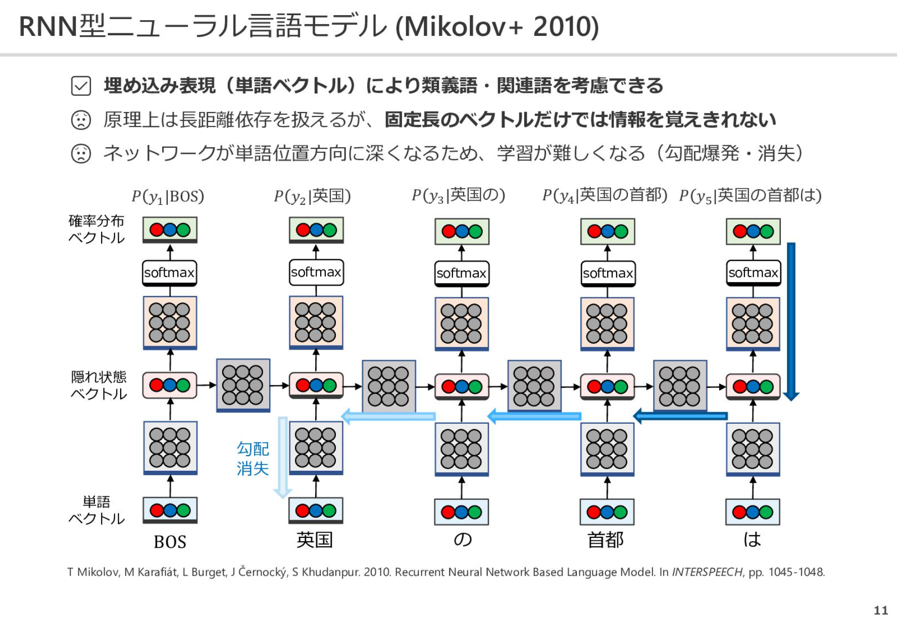

<!-- 記事URL:https://github.com/takata150802/tech_glossary/blob/main/output/ai/nlp.md# -->

## 自然言語処理 | NLP

- 言語的構造を持つ非構造データを扱う<a href="https://github.com/takata150802/tech_glossary/blob/main/output/ai/ai-general.md#5qmf5qKw5a2m57+SIHwgTWFjaGluZSBMZWFybmluZw==">機械学習</a>分野。<a href="https://github.com/takata150802/tech_glossary/blob/main/output/ai/nlp.md#44OI44O844Kv44OzIHwgVG9rZW4=">トークン</a>化、エンベディング、<a href="https://github.com/takata150802/tech_glossary/blob/main/output/ai/llm.md#44Ki44OG44Oz44K344On44OzIHwg44Ki44OG44Oz44K344On44Oz5qmf5qeLIHwgQXR0ZW50aW9uIHwgQXR0ZW50aW9uIG1lY2hhbmlzbQ==">Attention</a>機構を含む。

## リカレントニューラルネットワーク | RNN | Recurrent Neural Network

- <a href="https://github.com/takata150802/tech_glossary/blob/main/output/ai/nlp.md#6Ieq54S26KiA6Kqe5Yem55CGIHwgTkxQ">自然言語処理</a>で良く用いられる<a href="https://github.com/takata150802/tech_glossary/blob/main/output/dl-overview.md#5rex5bGk5a2m57+SIHwgRGVlcCBMZWFybmluZw==">深層学習</a>モデルの構造の1種。
- 入力系列を1つずつ逐次的に<a href="https://github.com/takata150802/tech_glossary/blob/main/output/dl-overview.md#44OL44Ol44O844Op44Or44ON44OD44OI44Ov44O844KvIHwgTmV1cmFsIE5ldHdvcms=">ニューラルネットワーク</a>に入力し、中間層の値を内部に保持していて、入力と中間層から出力を計算する。<a href="https://github.com/takata150802/tech_glossary/blob/main/output/dl-overview.md#44OL44Ol44O844Op44Or44ON44OD44OI44Ov44O844KvIHwgTmV1cmFsIE5ldHdvcms=">ニューラルネットワーク</a>。このような構造により、入力系列の時間的依存関係を捉えることができる。
- この特徴が、入力も出力も可変長な<a href="https://github.com/takata150802/tech_glossary/blob/main/output/ai/nlp.md#6Ieq54S26KiA6Kqe5Yem55CGIHwgTkxQ">自然言語処理</a>に適していたため、<a href="https://github.com/takata150802/tech_glossary/blob/main/output/ai/nlp.md#6Ieq54S26KiA6Kqe5Yem55CGIHwgTkxQ">自然言語処理</a>の分野で広く用いられていた。

**<a href="https://github.com/takata150802/tech_glossary/blob/main/output/ai/nlp.md#44Oq44Kr44Os44Oz44OI44OL44Ol44O844Op44Or44ON44OD44OI44Ov44O844KvIHwgUk5OIHwgUmVjdXJyZW50IE5ldXJhbCBOZXR3b3Jr">RNN</a>の課題:**

- 原理上は<a href="https://github.com/takata150802/tech_glossary/blob/main/output/ai/nlp.md#44OI44O844Kv44OzIHwgVG9rZW4=">トークン</a>間の長期依存性を捉えることがでるが、固定長ベクトルであるアクティベーションだけでは、長期依存性の情報を保持しきれない
- `ネットワークが単語位置方向に深くなるため、学習が難しい。勾配消失もしくは勾配爆発が起きやすい`
- (引用元): <a href="https://speakerdeck.com/chokkan/20230327_riken_llm?slide=12">https://speakerdeck.com/chokkan/20230327_riken_llm?slide=12</a>
  - 

## トークン | Token

- モデルの入出力単位であり、<a href="https://github.com/takata150802/tech_glossary/blob/main/output/ai/nlp.md#QlBFIHwgQnl0ZSBQYWlyIEVuY29kaW5n">BPE</a>や<a href="https://github.com/takata150802/tech_glossary/blob/main/output/ai/nlp.md#U2VudGVuY2VQaWVjZQ==">SentencePiece</a>などのサブワード分割により生成される。

## トークナイザー | トークナイザ | Tokenizer

- 生テキストをサブワード単位の<a href="https://github.com/takata150802/tech_glossary/blob/main/output/ai/nlp.md#44OI44O844Kv44OzIHwgVG9rZW4=">トークン</a>列に変換する処理器で、エンコーディングとデコーディングを担う。

## エンべディング | Embedding

- 離散<a href="https://github.com/takata150802/tech_glossary/blob/main/output/ai/nlp.md#44OI44O844Kv44OzIHwgVG9rZW4=">トークン</a>を連続値ベクトル空間へ写像する手法。<a href="https://github.com/takata150802/tech_glossary/blob/main/output/ai/nlp.md#6Kqe5b2ZIHwgVm9jYWJ1bGFyeQ==">語彙</a>空間のワンホットベクトルを低次元密ベクトルに変換し、意味的距離の保存を目指す。
- 通常は入力<a href="https://github.com/takata150802/tech_glossary/blob/main/output/ai/nlp.md#44Ko44Oz44G544OH44Kj44Oz44KwIHwgRW1iZWRkaW5n">エンべディング</a>と位置<a href="https://github.com/takata150802/tech_glossary/blob/main/output/ai/nlp.md#44Ko44Oz44G544OH44Kj44Oz44KwIHwgRW1iZWRkaW5n">エンべディング</a>の加算で初期入力が構成される。

## SentencePiece

- <a href="https://github.com/takata150802/tech_glossary/blob/main/output/ai/nlp.md#44OI44O844Kv44OzIHwgVG9rZW4=">トークン</a>化を言語非依存に行うためのサブワード単位<a href="https://github.com/takata150802/tech_glossary/blob/main/output/ai/nlp.md#44OI44O844Kv44OK44Kk44K244O8IHwg44OI44O844Kv44OK44Kk44K2IHwgVG9rZW5pemVy">トークナイザー</a>。Unigram Language Modelまたは<a href="https://github.com/takata150802/tech_glossary/blob/main/output/ai/nlp.md#QlBFIHwgQnl0ZSBQYWlyIEVuY29kaW5n">BPE</a>に基づき、<a href="https://github.com/takata150802/tech_glossary/blob/main/output/ai/nlp.md#6Kqe5b2ZIHwgVm9jYWJ1bGFyeQ==">語彙</a>と分割境界を学習する。スペースを専用<a href="https://github.com/takata150802/tech_glossary/blob/main/output/ai/nlp.md#44OI44O844Kv44OzIHwgVG9rZW4=">トークン</a>として扱うことで前処理不要。

## BPE | Byte Pair Encoding

- 頻出ペアのマージ操作を繰り返して<a href="https://github.com/takata150802/tech_glossary/blob/main/output/ai/nlp.md#6Kqe5b2ZIHwgVm9jYWJ1bGFyeQ==">語彙</a>を構成するデータ圧系サブワード分割アルゴリズム。単語の分割可能性を保ちつつ、<a href="https://github.com/takata150802/tech_glossary/blob/main/output/ai/nlp.md#6Kqe5b2ZIHwgVm9jYWJ1bGFyeQ==">語彙</a>サイズと未出語処理のトレードオフを実現。

## コサイン類似度 | Cosine Similarity

- ベクトル間の角度のコサイン値で類似度を測定。エンベディング間比較に使用。

## コーパス | Corpus

- テキストデータのデータセット。
- <a href="https://github.com/takata150802/tech_glossary/blob/main/output/ai/nlp.md#6Ieq54S26KiA6Kqe5Yem55CGIHwgTkxQ">自然言語処理</a>の分野で、解析対象となる文書群全体のこと。

## 語彙 | Vocabulary

- <a href="https://github.com/takata150802/tech_glossary/blob/main/output/ai/nlp.md#44Kz44O844OR44K5IHwgQ29ycHVz">コーパス</a>内に現れる全ての単語を集めたもの

## 単語袋モデル | Bag of Words | BoW

- 情報検索の分野で、ある文章をベクトルで表現するための手法の一種。
- ある文章$d$に対して、<a href="https://github.com/takata150802/tech_glossary/blob/main/output/ai/nlp.md#6Kqe5b2ZIHwgVm9jYWJ1bGFyeQ==">語彙</a>に含まれる単語の出現回数をカウントし、それを以ってその文章$d$を表すベクトルする。
- 語順は考慮されない。
- 具体例:
  - (引用元): <a href="https://qiita.com/kazukiii/items/d717add45bbc76a71430">https://qiita.com/kazukiii/items/d717add45bbc76a71430</a>
  - 「This is an apple」を<a href="https://github.com/takata150802/tech_glossary/blob/main/output/ai/nlp.md#5Y2Y6Kqe6KKL44Oi44OH44OrIHwgQmFnIG9mIFdvcmRzIHwgQm9X">BoW</a>でベクトル化すると[1, 0, 0 ,1, 1, 01, ...]となる。
    - 

## TF-IDF | Term Frequency–Inverse Document Frequency

- 情報検索の分野で、ある文章をベクトルで表現するための手法の一種。
- <a href="https://github.com/takata150802/tech_glossary/blob/main/output/ai/nlp.md#5Y2Y6Kqe6KKL44Oi44OH44OrIHwgQmFnIG9mIFdvcmRzIHwgQm9X">Bag of Words</a>の改良版。
- 語順は考慮されない。
- ある文章$d$の各単語$t$に対して、その単語$t$がどれくらい重要かを表す統計量$\\text{tf-idf}(t,d)$を計算し(※下記式参照)、全単語分並べたベクトルを以って、その文章$d$を表すベクトルとする。
  - 第一項$\\text{tf}(t,d)$は、Term frequency (単語頻度)、すなわちある文書$d$内でのある単語$t$の出現頻度である。
  - 第二項$\\log \\frac{N}{\\text{df}(t)}$は、Inverse document frequency (逆文書頻度)、すなわちある単語$t$が全文章内でどれだけ珍しいかを示す項で、ある単語$t$を含む文書数を総文章数$N$で除算し、その商の逆数の対数をとったものである。
    - これは、例えば"the"という非常に普遍的で高頻出な単語を多く含む文書を誤って重要視してしまうことを避けるために用いられる。

$$
\\text{tf-idf}(t,d) = \\text{tf}(t,d) \\cdot \\log \\frac{N}{\\text{df}(t)} \\
$$
